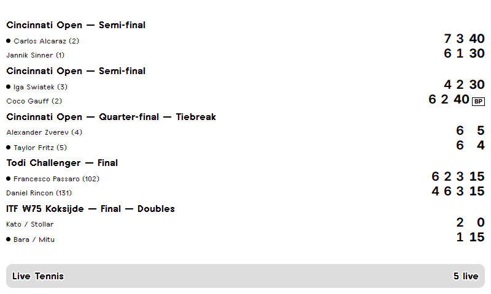
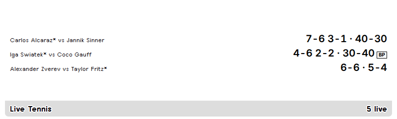
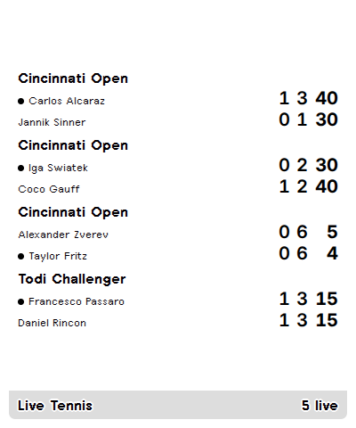
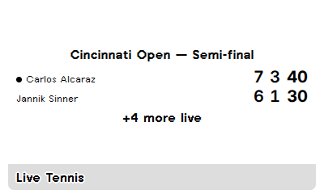
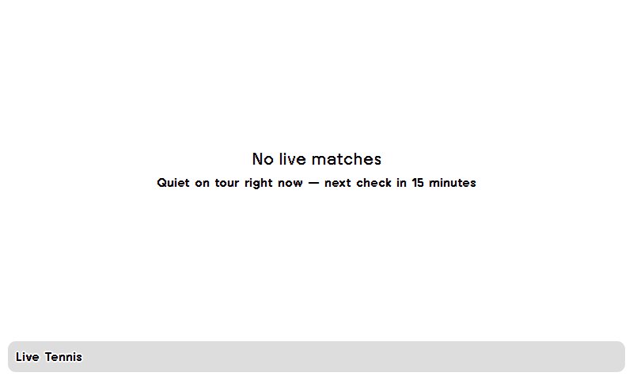

# TRMNL Live Tennis

Live tennis scores on your [TRMNL](https://usetrmnl.com) e-ink display — ATP, WTA,
Challenger, ITF and juniors, powered by the [Live Tennis API](https://livetennisapi.com).

Each refresh shows the matches in progress right now:

- **Full screen** — up to 5 live matches with per-set games, current points, a
  serving dot next to the server, and a **BP** marker when the returner holds a
  break point.
- **Half horizontal** — up to 3 matches, one line each (`*` marks the server).
- **Half vertical** — up to 4 matches: sets won, games in the current set, points.
- **Quadrant** — the top live match plus a count of the rest.

When nothing is being played it shows a clean "No live matches" state, and if the
API can't be reached (e.g. a wrong key) it says so instead of rendering stale data.

## Screenshots



| Half horizontal | Half vertical | Quadrant | Empty state |
|---|---|---|---|
|  |  |  |  |

*All images are rendered from the checked-in [`sample/data.json`](sample/data.json)
with the TRMNL design-system CSS — framework mocks, not device captures.*

## Setup

1. **Get an API key** — the free tier is enough:
   [livetennisapi.com/subscribe/free](https://livetennisapi.com/subscribe/free)
2. In TRMNL, create a **Private Plugin** and import this plugin — either with
   [trmnlp](https://github.com/usetrmnl/trmnlp) (`trmnlp login && trmnlp push`
   from a clone of this repo), or by pasting `src/settings.yml` values and the
   `src/*.liquid` markup into the private-plugin editor (put `src/shared.liquid`
   in the Shared Markup section).
3. Paste your API key into the plugin's **Live Tennis API key** field.
4. Optionally pick a **Tour** filter (ATP, WTA, Challenger, ITF, Juniors); the
   default shows all tours. Each tour includes its doubles draws.

## Refresh rate and the free tier — honest math

The plugin polls `GET /matches?status=live` once per refresh. The default
refresh interval is **15 minutes**: 4 calls/hour × 24 = **~96 calls/day**, which
fits inside the free tier's **100 requests/day** (the free tier also allows
30 requests/minute — one poll per refresh doesn't come near it).

- A faster refresh does **not** fit free: 10-minute polling is ~144 calls/day,
  5-minute polling is ~288. For that you need a paid tier —
  [pricing](https://livetennisapi.com/#pricing).
- Historical results, H2H, match statistics and odds are separate paid
  endpoints (BASIC/PRO/ULTRA) and are deliberately not used by this plugin.
- If you run other things on the same free key, remember this plugin is
  already spending ~96 of your 100 daily requests.

## Data notes

- Score fields bind 1:1 to the API's `Match.score` object: `sets` `[p1, p2]`,
  `games` as per-set lists per player, `points` as tennis strings
  (`"0"`/`"15"`/`"30"`/`"40"`/`"AD"`), `server` (1, 2 or null), `is_tiebreak`.
- The **BP** marker is *derived* in the template from `points` + `server`
  (returner at 40 or AD against the serve, outside tiebreaks) — the REST list
  endpoint does not expose a break-point flag. The API's WebSocket feed does
  push explicit `break_point` frames, but that's beyond a polling plugin.
- API reference: [docs.livetennisapi.com](https://docs.livetennisapi.com).

## Development

```sh
gem install trmnl_preview        # or use ./bin/trmnlp (falls back to Docker)
export LIVE_TENNIS_API_KEY=your-key
trmnlp serve                     # preview at http://localhost:4567
```

`.trmnlp.yml` feeds the key from `$LIVE_TENNIS_API_KEY` into the plugin's
custom field. To preview with deterministic data (or when no matches are
live), paste the contents of `sample/data.json` under `variables:` in
`.trmnlp.yml`. CI runs `trmnlp lint` on every push and PR.

## License

[MIT](LICENSE) © Live Tennis API
